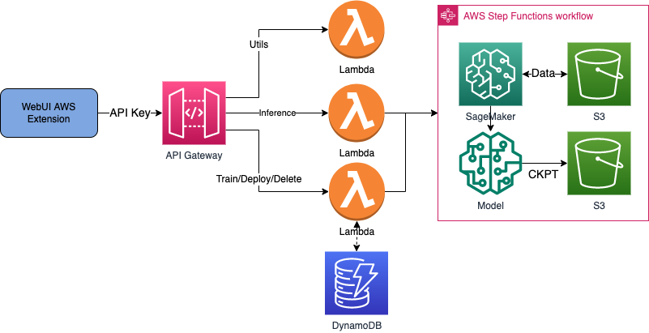

Diagram below is the brief view of internal workflow between our extension and middleware, user will keep launching community WebUI onto standalone EC2/local server with our extension installed, while the training and inference part will be pass onto AWS cloud (SageMaker, S3 etc.) through the RESTful API provided by middleware installed on user’s AWS account. Note the middleware is per AWS account, means it could be installed separately as work node to communicate with WebUI as control node, user only need to input endpoint URL and API key per account to decide which specific AWS account will be used for successive jobs.

Overall Workflow

The major function of middleware is to provide RESTful API for WebUI extension to interact with AWS cloud resource (SageMaker, S3 etc.) with OpenAPI conformant schema, it will handling the request authentication, request dispatch to specific SageMaker/S3 API (SageMaker.jumpstart/model/predictor/estimator/tuner/utils etc.) and model lifecycle.
Diagram below is the overall architecture of middleware, including API Gateway and Lambda to fulfill the RESTful API function and Step Function to orchestrate the model lifecycle.

Middleware Architecture

To keep container image of extension in sync with community, additional CI/CD pipeline (fig shown below) may needed to auto track community commits and pack & build new container image, then user can easily launch latest extension without any manual operation.

Image CI/CD Workflow
