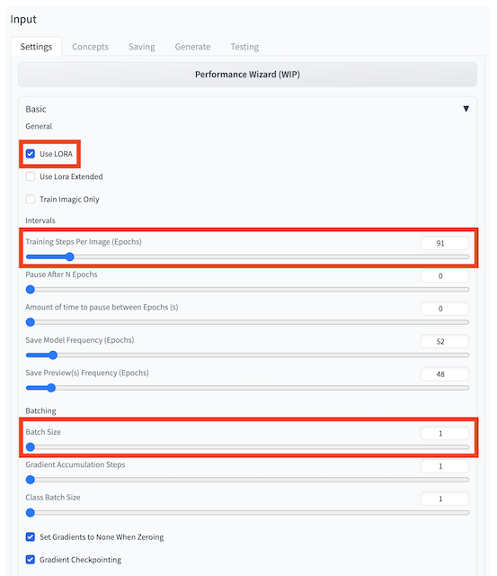
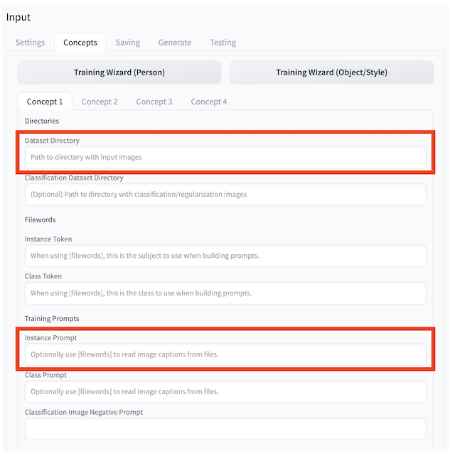
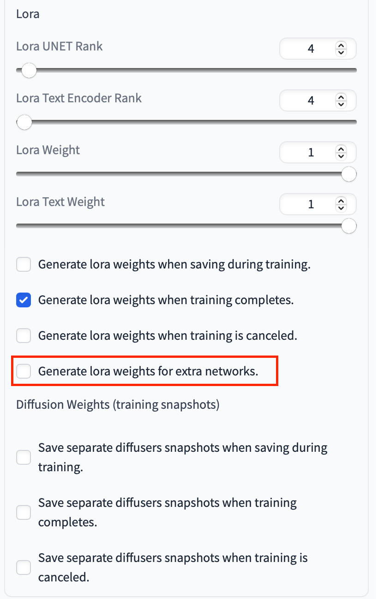

# Dreambooth Guide
You can open **Dreambooth** tab, by combining the use with native Dreambooth, the tab **Create from Cloud** and **Select from Cloud** that newly added by the solution, you can achieve  cloud-based model creating and training in Dreambooth.

## Create Model
1. Open **Dreambooth** tab, **Model** subtab **Create From Cloud**.

2. Enter a model name in the **Name** text box.

    !!! Important "Notice"
        Please note the naming format requirements: the name can only contain alphanumeric characters and dashes ("-").

3. Select one checkpoint under **Source Checkpoint** dropdown list.
> **Note：** The checkpoint files here include two sources: files starting with "local" are locally stored checkpoint files, while those starting with "cloud" are checkpoint files stored on Amazon S3. For first-time use, it is recommended to select a local checkpoint file.

4. Click **Create Model From Cloud** to start model creation on cloud. **Model Creation Jobs Details** field will instantly update with the progress of the model creation job. When the status changes to *Complete*, it indicates that the model creation is finished.

## Train Model
1. Open **Dreambooth** tab, **Model** subtab, **Select From Cloud**.
2. Fresh and select the model from **Model** dropd down list that need to train.
3. Set corresponding parameters in **Input** session.
    - Set training parameters
        - Checking *Lora* can accelerate the training process.
        - The *Training Steps Per Image (Epochs)* represents the number of iterations for training a single image and can be left at the default value.
     
    - Set the concepts that need to be trained. A total of four concepts can be set, and we will use the first concept as an example.
        - In the *Dataset Directory* field, enter the path to the images required for training. It can be a path on a web server or an S3 path. For S3 paths, you can obtain them by uploading the data through AWS Dataset Management or by uploading them to S3 on your own. The path should start with “s3://".
        - In the *Instance Prompt* section under *Training Prompts*, enter the keywords for the concept. These keywords will be used to generate the concept during the training process in txt2img. Therefore, avoid using common English words (as they might get confused with other concepts in the base model).
     
    - You need to check **Save Checkpoint to Subdirectory** to save the model to a subdirectory. 
    - If you need to save the lora model separately (the model file will be smaller, but it needs to be used with the SD basic model), please check **Generate lora weights for extra networks**.
     

4. Click **SageMaker Train** to start model training task. The **Training Job Details** section will be updated in real-time with the status of the model training job. When the status changes to *Complete*, an email notification will be sent to the email address provided during the initial deployment of the solution, indicating that the model training is complete.
5. Future steps. For example: Navigate to **txt2img** tab **Amazon SageMaker Inference** panel, check trained model by refreshing **Stable Diffusion Checkpoint** dropdown list.  

