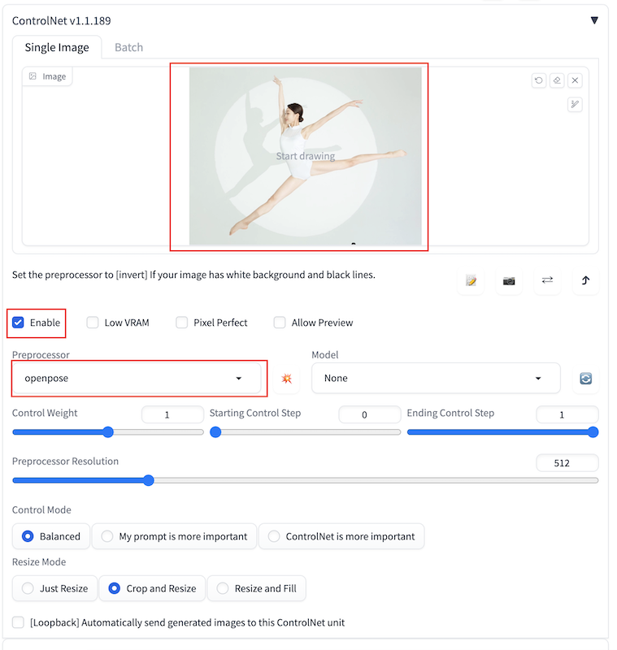

# 使用img2img进行云上推理

您可以打开**img2img**标签页，通过结合使用**img2img**原生区域及解决方案新增面板**Amazon SageMaker Inference**，实现调用云上资源的**img2img**推理工作。 

## img2img的使用方法
### img2img不同标签功能的使用

1. 进入**img2img**标签页，展开**Amazon SageMaker Inference**面板。
2. 输入推理所需参数。同于本地推理，您可以按需编辑**img2img**原生的推理参数，包括提示词，负提示词，取样参数，推理参数等。对于**img2img**，**sketch**，**inpaint**，**inpaint sketch**和**inpaint upload**，都可以按照原生方式进行图片上传和修饰。
下面以**inpaint sketch**为例:

3. 选择推理节点。点击**Select Cloud SageMaker Endpoint**右侧的刷新按钮，选择一个处于**InService**状态的推理节点。

    !!! Important "提示" 
        此项为必选项。如果选择处于其他状态的推理节点，或者选择为空，点击**Generate on Cloud**开启云上推理功能时会报错。

4. 点击模型下拉框右侧的刷新按钮，选择推理所需的**Stable Diffusion Checkpoint**（必选，可多选）及其他所需的**Extra Networks for Cloud Inference**（可选，并且可多模型多选叠加）。
5. 点击**Generate on Cloud**。
6. 查看推理结果。通过点击**Inference Job JDs**右侧的刷新按钮进行下拉列表刷新，查看最上方的、符合推理提交时间戳的**Inference Job ID**。img2img标签页右上方的**Output**区域会显示推理的结果，包括图片，提示词以及推理的参数等。在此基础上，可以点击**Save**或者**Send to extras**等，进行后续工作流。
> **补充：** 列表按照推理时间倒序排列，即最近的推理任务排在最上方。每条记录的命名格式为**推理时间->任务类型（txt2img/img2img/interrogate_clip/interrogate_deepbooru）->推理状态（succeed/in progress/fail） ->inference id**。

### Interrogate clip/deepbooru功能的使用

1. 进入**img2img**标签页，展开**Amazon SageMaker Inference**面板。
2. Interrogate只需要在**img2img**标签页把图片上传即可。

3. 选择推理节点。点击**Select Cloud SageMaker Endpoint**右侧的刷新按钮，选择一个处于**InService**状态的推理节点。

    !!! Important "提示" 
        此项为必选项。如果选择处于其他状态的推理节点，或者选择为空，点击**Generate on Cloud**开启云上推理功能时会报错。

4. 点击**Interrogate CLIP on cloud**或和**Interrogate DeepBooru on cloud**。
6. 查看推理结果。通过点击**Inference Job JDs**右侧的刷新按钮进行下拉列表刷新，查看最上方的、符合推理提交时间戳的**Inference Job ID**。img2img标签页右上方的**Output**区域会显示推理的结果，包括图片，提示词以及推理的参数等。在此基础上，可以点击**Save**或者**Send to extras**等，进行后续工作流。

### 连续使用场景

1. 按**通用场景**使用流程，完成参数录入，并点击**Generate on Cloud**提交第一次推理任务。
2. 等待右侧**Output**部分出现了新的**inference id**。
3. 在新的**Inference Job ID**出现后，便可再次点击**Generate on Cloud**进行下一次推理。

## Controlnet的使用方法

### openpose的使用方法
1. 打开ControlNet面板，勾选**Enabel**，选择**Preprocessor**为**openpose**，同时上传图片。
 
    
2. 在**Amazon SageMaker Inference**面板的里面选择**Stable Diffusion Checkpoint**和**ControlNet-Model**。如下方示例图中选择**v1-5-pruned-emaonly.safetensors**和**control_openpose-fp16.safetensors**。提示词**a cute dog**。

3. 点击**Generate on Cloud**。

4. 查看推理结果。通过点击**Inference Job JDs**右侧的刷新按钮进行下拉列表刷新，查看最上方的、符合推理提交时间戳的Inference Job ID。

5. 后续操作。如需对推理图片保存或作进一步处理，可以点击**Save**或者**Send to img2img**等。
